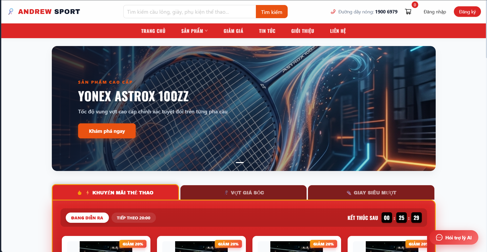
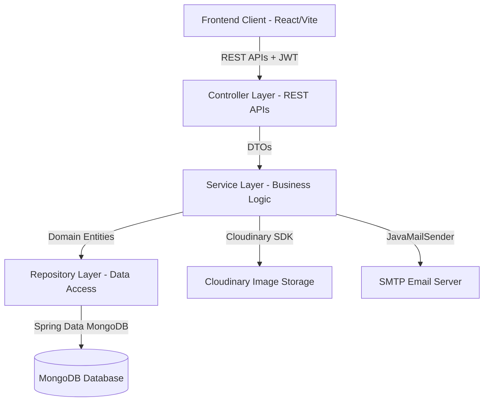

# AndrewSport - Premium Badminton E-commerce System



AndrewSport là hệ thống website thương mại điện tử chuyên nghiệp cung cấp các dụng cụ thể thao cao cấp (vợt cầu lông, giày, thời trang, balo, phụ kiện) chính hãng. Dự án được thiết kế theo tiêu chuẩn thẩm mỹ cao, tích hợp các tính năng công nghệ hiện đại và tuân thủ nghiêm ngặt các nguyên lý thiết kế phần mềm bền vững.

---

## 📦 Công nghệ Sử dụng (Technology Stack)

Hệ thống được xây dựng trên mô hình phân tách hoàn toàn giữa **Frontend** và **Backend** (Decoupled Architecture) kết hợp lưu trữ đám mây và cơ sở dữ liệu phi quan hệ:

### 1. Phân hệ Frontend (Client-side)
- **Framework**: ReactJS (Vite) cung cấp tốc độ phản hồi cực nhanh (HMR) và hiệu năng tối ưu.
- **UI Library**: Ant Design (v5) được cấu hình tập trung thông qua `<ConfigProvider>` thống nhất màu sắc nhận diện thương hiệu (màu cam VNB chủ đạo `#E95211`) và kiểu chữ trên toàn bộ ứng dụng.
- **Routing**: React Router DOM (v6) quản lý định tuyến trang động.
- **State Management**: Sử dụng các React Hooks, Context API và Local Storage được mã hóa/bảo vệ thông minh để lưu trữ giỏ hàng, thông tin phiên làm việc.
- **Animations**: CSS3 Keyframes phối hợp với Slick Carousel (Antd Carousel) tạo ra trải nghiệm vuốt chạm, chuyển cảnh trượt mượt mà cho hệ thống Banner Carousel động.

### 2. Phân hệ Backend (Server-side)
- **Framework**: Java Spring Boot (v3.x) chịu trách nhiệm cung cấp hệ thống RESTful API bảo mật và hiệu năng cao.
- **Security & Authentication**: Spring Security kết hợp JSON Web Token (JWT) để mã hóa, phân quyền chặt chẽ giữa khách hàng và quản trị viên (`ROLE_ADMIN`).
- **Database**: MongoDB (phi quan hệ) lưu trữ linh hoạt các mô hình dữ liệu phức tạp dạng tài liệu (Documents) như Đơn hàng (Orders), Thẻ bảo hành điện tử (Warranties), và Yêu cầu hoàn tiền (Refund Claims).
- **Asynchronous Task**: Spring `@Async` xử lý các tác vụ nền tốn tài nguyên (như gửi email hóa đơn).
- **Email Service**: Spring Boot Starter Mail kết hợp mẫu HTML phong cách thương hiệu cao cấp.
- **Cloud Service**: Cloudinary SDK dùng để tải ảnh lên đám mây, tự động nén chất lượng (`q_auto`) và tối ưu định dạng (`f_auto`).

---

## 🏛️ Kiến trúc Hệ thống (System Architecture)

Dự án áp dụng kiến trúc **Layered Architecture (Kiến trúc phân tầng)** chuẩn mực giúp tách biệt rạch ròi các thành phần hệ thống:



### Phân rã thư mục chính:
- **Presentation Layer (Controllers)**: Điểm tiếp nhận các yêu cầu HTTP, kiểm tra tính hợp lệ sơ bộ của dữ liệu và điều hướng luồng nghiệp vụ.
- **Business Logic Layer (Services & ServiceImpls)**: Nơi tập trung toàn bộ nghiệp vụ lõi của hệ thống. Controller chỉ gọi Service thông qua các **Interface** trừu tượng.
- **Data Access Layer (Repositories)**: Sử dụng các interface kế thừa `MongoRepository` để tương tác trực tiếp với MongoDB.
- **Domain Model Layer (Models)**: Định nghĩa cấu trúc các thực thể dữ liệu lưu trữ trong MongoDB.

---

## 🔄 Quy trình Nghiệp vụ Lõi (Business Processes)

Hệ thống tích hợp 6 quy trình nghiệp vụ thông minh kết hợp chặt chẽ giữa Frontend và Backend:

### 1. Quy trình Mua hàng & Thanh toán (Checkout Flow)
- Người dùng thêm sản phẩm và các biến thể cụ thể (vợt, giày theo size/màu) vào giỏ hàng cục bộ.
- Hệ thống kiểm tra số lượng tồn kho theo thời gian thực (Real-time Inventory Check) trước khi tạo đơn hàng.
- Khi đặt hàng thành công, đơn hàng được thiết lập trạng thái mặc định là `PAID`. Hệ thống tự động kích hoạt tiến trình chạy ngầm gửi hóa đơn điện tử.

### 2. Quy trình Gửi Hóa đơn Điện tử HTML Tự động
- Nhằm tối ưu thời gian phản hồi API cho người dùng, nghiệp vụ gửi email được tách riêng và chạy bất đồng bộ (`@Async`).
- Hệ thống tự động sinh một mẫu hóa đơn HTML chất lượng cao chứa đầy đủ thông tin đơn hàng, chi tiết từng sản phẩm, giá bán, phương thức thanh toán và các chính sách đổi trả đi kèm với màu cam VNB đặc trưng gửi thẳng đến hòm thư người dùng.

### 3. Quy trình Sinh Mã Bảo hành Điện tử Tự động
- Khi quản trị viên chuyển trạng thái đơn hàng sang `DELIVERED` (Đã giao hàng), hệ thống tự động thiết lập ngày nhận hàng thực tế (`deliveryDate`).
- Đồng thời, Service bảo hành sẽ tự động tạo các **Thẻ bảo hành điện tử** độc bản dạng mã `WAR-XXXXXXXX` cho từng sản phẩm trong đơn hàng. 
- Thời hạn bảo hành được tính toán tự động dựa trên số tháng cấu hình riêng của sản phẩm đó trong cơ sở dữ liệu (mặc định là 12 tháng).

### 4. Quy trình Yêu cầu Bảo hành (Warranty Claim Process)
- Khách hàng truy cập Lịch sử mua hàng, xem thẻ bảo hành điện tử của mình, sao chép mã bảo hành và gửi yêu cầu sửa chữa.
- Người dùng tải ảnh chụp tình trạng lỗi sản phẩm lên. Ảnh được chuyển trực tiếp từ Client lên đám mây Cloudinary và lưu lại URL trên MongoDB.
- Admin nhận được yêu cầu trong trang quản trị, đối chiếu tính hợp lệ của mã bảo hành (còn hạn sử dụng, đúng sản phẩm) và phê duyệt lịch hẹn sửa chữa cho khách.

### 5. Quy trình Đổi trả & Hoàn tiền Nghiêm ngặt (7-Day Return Rule)
- Hệ thống áp dụng quy tắc vàng kiểm soát đổi trả: Người dùng chỉ được phép yêu cầu hoàn tiền trong vòng **đúng 7 ngày kể từ ngày nhận hàng thực tế (`deliveryDate`)** ghi nhận trên hệ thống. 
- Nút "Hoàn tiền" trên giao diện lịch sử mua hàng của khách sẽ tự động ẩn đi nếu đơn hàng đã giao vượt quá thời hạn 7 ngày.
- Khi gửi yêu cầu hoàn tiền, khách hàng bắt buộc phải tải lên hình ảnh sản phẩm còn nguyên vẹn và ghi rõ lý do.
- Quản trị viên sử dụng công cụ kiểm duyệt chuyên nghiệp tích hợp bộ xoay ảnh/phóng to của Ant Design để đánh giá ngoại quan sản phẩm trước khi đưa ra quyết định Duyệt hoặc Từ chối hoàn tiền.

### 6. Quy trình Nạp & Tối ưu hóa Ảnh trên Cloudinary
- Toàn bộ hình ảnh sản phẩm, ảnh lỗi bảo hành, và ảnh đổi trả đều được đẩy trực tiếp lên Cloudinary.
- Tận dụng sức mạnh tối ưu hóa ảnh của Cloudinary thông qua cấu hình tham số tự động nén chất lượng (`q_auto`) và tự động chuyển đổi định dạng ảnh phù hợp nhất với thiết bị của người dùng (`f_auto`), đảm bảo tốc độ tải trang tối đa cho Frontend.

---

## 💡 Điểm Nhấn Kỹ Thuật & Giải Pháp Tối Ưu (Technical Highlights & Optimizations)

Để tạo ra một sản phẩm đạt chuẩn vận hành thương mại thực tế (Production-ready), hệ thống đã giải quyết thành công các bài toán kỹ thuật khó sau:

### 1. Xử lý Bất đồng bộ (Asynchronous Non-blocking) tối ưu phản hồi API
- **Bài toán**: Nghiệp vụ gửi email hóa đơn điện tử HTML chứa nhiều thông tin và hình ảnh cần kết nối tới SMTP Server bên ngoài. Nếu xử lý đồng bộ (Synchronous), yêu cầu thanh toán/checkout của người dùng sẽ bị nghẽn khoảng 2 đến 3 giây, làm giảm trải nghiệm mua sắm nghiêm trọng.
- **Giải pháp**: Tách tác vụ gửi email thành một tiến trình chạy ngầm bất đồng bộ hoàn toàn bằng cách sử dụng annotation `@Async` và cấu hình bộ chia luồng (ThreadPoolTaskExecutor) riêng trong Spring Boot.
- **Kết quả**: Thời gian phản hồi API thanh toán giảm từ **~3000ms xuống dưới 100ms**, giúp trải nghiệm thanh toán của khách hàng diễn ra tức thì và mượt mà.

### 2. Giải pháp Tối ưu hóa Hình ảnh Đám mây (Cloud Image Optimization)
- **Bài toán**: Một website thương mại điện tử chứa rất nhiều ảnh sản phẩm dung lượng lớn. Tải ảnh gốc trực tiếp từ máy chủ sẽ làm chậm tốc độ tải trang (High LCP/FCP) và tiêu tốn băng thông máy chủ cực kỳ lớn.
- **Giải pháp**: Tích hợp Cloudinary SDK ở tầng Service của Backend. Toàn bộ ảnh tải lên đều được thiết lập tham số tự động nén dung lượng dựa trên thuật toán thông minh (`q_auto`) và tự động chuyển đổi định dạng ảnh phù hợp nhất với trình duyệt đích, ví dụ chuyển sang WebP/AVIF trên Chrome (`f_auto`).
- **Kết quả**: Dung lượng ảnh tải về giảm trung bình từ **70% - 80%** nhưng vẫn giữ nguyên chất lượng hiển thị sắc nét, giúp điểm số tối ưu hiệu năng Core Web Vitals (LCP) trên Google PageSpeed Insights đạt mức xuất sắc.

### 3. Khắc phục lỗi Layout Collapsing phức tạp trong thư viện Slider
- **Bài toán**: Thư viện Ant Design Carousel (phát triển trên nhân `react-slick`) tự động ghi đè và loại bỏ các thuộc tính layout gốc (`position`, `height`, `display`) của các thẻ con trực tiếp, dẫn đến hiện tượng khung banner bị thu hẹp (collapse) thành một vệt đen mỏng 30px và lớp phủ tuyệt đối đè lên che khuất toàn bộ giao diện trang chủ.
- **Giải pháp**: Nghiên cứu sâu cấu trúc cây DOM của thư viện và thiết kế một mô hình lồng thẻ bảo vệ (Nesting Hierarchy/Plain Wrapper Div). Bọc toàn bộ thẻ slide chính bên trong một `<div>` trống trung gian để làm "bia đỡ" cho các thuộc tính ghi đè của thư viện, giúp slide cấp 2 bảo toàn nguyên vẹn thuộc tính `position: 'relative'`, `height: '380px'`, đồng thời thiết lập ảnh nền trực tiếp lên slide để tối ưu hóa hiệu năng render.
- **Kết quả**: Khắc phục triệt để lỗi sập giao diện, đảm bảo banner hiển thị ổn định, mượt mà và triệt tiêu hoàn toàn hiện tượng dịch chuyển bố cục (Cumulative Layout Shift - CLS = 0).

### 4. Kiến trúc Bảo mật Stateless bảo vệ dữ liệu nhạy cảm
- **Bài toán**: Tránh lộ lọt dữ liệu nhạy cảm của người dùng (như mật khẩu, token quyền hạn) trên Local Storage của trình duyệt, đồng thời bảo vệ các endpoint quản trị nhạy cảm trước các cuộc tấn công leo thang đặc quyền.
- **Giải pháp**:
  - Triển khai cơ chế xác thực không lưu trạng thái (Stateless Authentication) bằng **Spring Security + JWT**. Token được kiểm duyệt nghiêm ngặt trên mỗi yêu cầu thông qua bộ lọc bảo mật ở tầng Gateway.
  - Sử dụng mô hình **Data Transfer Object (DTO)** để lọc bỏ toàn bộ thông tin nhạy cảm của thực thể cơ sở dữ liệu MongoDB trước khi trả phản hồi về phía Client.
  - Ẩn/hiển thị linh hoạt các nút chức năng (Hoàn tiền, Bảo hành) trên giao diện dựa trên quyền hạn phiên làm việc đã xác thực và điều kiện nghiệp vụ cụ thể.

### 5. Ràng buộc Nghiệp vụ chặt chẽ ở hai đầu (Full-stack Validation)
- **Bài toán**: Ngăn chặn người dùng gian lận gửi các yêu cầu Hoàn tiền vượt quá thời hạn quy định (7 ngày kể từ ngày nhận hàng) bằng cách sửa đổi mã nguồn client hoặc giả mạo thời gian gửi request.
- **Giải pháp**: Thiết lập hàng rào bảo vệ kép:
  - **Frontend**: Tự động tính toán khoảng thời gian chênh lệch giữa ngày hiện tại và ngày nhận hàng thực tế (`deliveryDate`) từ API đơn hàng để tự động ẩn nút "Hoàn tiền" trên UI sau 7 ngày.
  - **Backend**: Kiểm tra thực tế thời điểm nhận yêu cầu ở tầng Service bằng cách truy xuất dữ liệu đơn hàng gốc từ MongoDB và so sánh chênh lệch thời gian trên máy chủ. Nếu vượt quá 7 ngày, hệ thống lập tức từ chối xử lý và ném ra ngoại lệ `IllegalArgumentException`, bảo vệ toàn vẹn logic nghiệp vụ ở mức tối đa.

---

## 🛠️ Thiết kế Phần mềm & Design Patterns (SOLID Principles)

Hệ thống được thiết kế dựa trên các nguyên lý phát triển phần mềm chuẩn mực nhằm đảm bảo tính dễ đọc, dễ bảo trì và dễ mở rộng:

### 1. Áp dụng Nguyên lý SOLID
- **Single Responsibility Principle (Đơn nhiệm - S)**: Mỗi class chỉ đảm nhận một trách nhiệm duy nhất. Ví dụ: `CloudinaryServiceImpl` chịu trách nhiệm duy nhất là xử lý ảnh tải lên đám mây; `EmailService` chỉ đảm nhận việc định dạng và gửi mail; các repository độc lập đảm nhận truy xuất dữ liệu riêng biệt.
- **Open/Closed Principle (Mở/Đóng - O)**: Thiết kế hệ thống dễ mở rộng tính năng mới thông qua việc định nghĩa các Service Interfaces nhưng hạn chế sửa đổi trực tiếp cấu trúc cốt lõi. Người dùng có thể tạo ra các class triển khai mới (ví dụ: `WarrantyServiceImplV2`) để thay đổi logic mà không cần sửa đổi Controller hay Repository.
- **Liskov Substitution Principle (Thay thế Liskov - L)**: Các lớp con triển khai (như `OrderServiceImpl`) tuân thủ nghiêm ngặt và kế thừa hoàn hảo các giao thức định nghĩa bởi Interface cha (`OrderService`), đảm bảo không phá vỡ logic nghiệp vụ hiện tại của hệ thống.
- **Interface Segregation Principle (Phân tách Interface - I)**: Chia nhỏ các interface lớn, cồng kềnh thành nhiều interface nhỏ, chuyên biệt. Khách hàng hoặc các Service khác chỉ cần phụ thuộc vào đúng interface chứa các phương thức mà chúng thực sự sử dụng.
- **Dependency Inversion Principle (Đảo ngược Phụ thuộc - D)**: Các lớp cấp cao không phụ thuộc vào lớp cấp thấp, cả hai đều phụ thuộc vào lớp trừu tượng (Abstraction). Trong toàn bộ dự án Spring Boot, các Controller tuyệt đối không khởi tạo cứng Service bằng từ khóa `new`, thay vào đó phụ thuộc hoàn toàn vào các **Interface Service** thông qua cơ chế tự động tiêm phụ thuộc (Dependency Injection) của Spring Container.

### 2. Các Design Patterns Sử dụng
- **Repository Pattern**: Tách biệt hoàn toàn tầng truy xuất dữ liệu (Data Access Layer) khỏi tầng nghiệp vụ (Service Layer), che giấu các câu lệnh truy vấn MongoDB phức tạp phía sau các thực thể Repository trừu tượng.
- **Service Layer Pattern**: Tổ chức một tầng trung gian chứa toàn bộ logic nghiệp vụ, giúp đảm bảo Controllers luôn mỏng và dễ đọc (Thin Controllers, Fat Services).
- **Data Transfer Object (DTO) Pattern**: Sử dụng các lớp DTO để đóng gói dữ liệu truyền tải qua mạng giữa Client và Server, giúp bảo vệ cấu trúc cơ sở dữ liệu gốc của MongoDB, tránh lộ các trường thông tin nhạy cảm.
- **Singleton Pattern**: Toàn bộ các Service Beans, Controller Beans và Configuration Beans trong Spring Boot đều được khởi tạo dưới dạng Singleton mặc định để tối ưu hóa bộ nhớ và quản lý vòng đời nhất quán.

---

## 🚀 Hướng dẫn Khởi chạy Dự án (Setup & Run)

### 📋 Yêu cầu hệ thống
- Java Development Kit (JDK) phiên bản 17 hoặc 21.
- Node.js phiên bản 18+.
- Cơ sở dữ liệu MongoDB (Local hoặc MongoDB Atlas).
- Tài khoản Cloudinary để lưu trữ hình ảnh.

### 1. Khởi chạy Backend (Java Spring Boot)
1. Di chuyển vào thư mục backend:
   ```bash
   cd backend
   ```
2. Tạo tệp cấu hình môi trường `.env` ở gốc thư mục backend và cấu hình các thông số:
   ```env
   MONGO_URI=mongodb://localhost:27017/andrewsport
   JWT_SECRET=your_super_secret_jwt_key_here
   SMTP_USERNAME=your_gmail_username@gmail.com
   SMTP_PASSWORD=your_gmail_app_password
   CLOUDINARY_CLOUD_NAME=your_cloudinary_name
   CLOUDINARY_API_KEY=your_cloudinary_key
   CLOUDINARY_API_SECRET=your_cloudinary_secret
   ```
3. Chạy ứng dụng Spring Boot bằng IDE của bạn (IntelliJ, VS Code) hoặc sử dụng lệnh Maven:
   ```bash
   mvn spring-boot:run
   ```

### 2. Khởi chạy Frontend (Vite + React)
1. Di chuyển vào thư mục frontend:
   ```bash
   cd frontend
   ```
2. Cài đặt các thư viện phụ thuộc:
   ```bash
   npm install
   ```
3. Khởi chạy môi trường phát triển cục bộ:
   ```bash
   npm run dev
   ```
4. Mở trình duyệt và truy cập: `http://localhost:5173/` để trải nghiệm hệ thống thương mại điện tử AndrewSport cao cấp!
