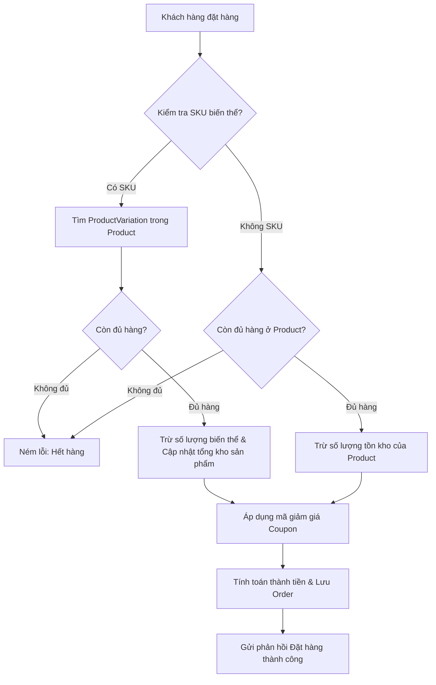

# Nghiệp Vụ, Giao Dịch (Transaction) và Kiểm Thử Đơn Vị (Unit Test)

Tài liệu này mô tả chi tiết các nghiệp vụ chính của hệ thống **AndrewSport E-Commerce**, cách cấu hình và áp dụng giao dịch (transaction) với cơ sở dữ liệu MongoDB, cùng hướng dẫn viết kiểm thử đơn vị (Unit Test) sử dụng thư viện JUnit 5 và Mockito.

---

## 1. Nghiệp Vụ Hệ Thống (Business Operations)

Dự án AndrewSport tập trung vào các luồng nghiệp vụ mua bán dụng cụ thể thao (Cầu lông, Tennis, Pickleball) và tích hợp các tính năng hiện đại như OTP, Social Login và Trợ lý AI.

### 1.1 Quản Lý Đơn Hàng & Kho Hàng (Order & Inventory Management)

Mối liên kết giữa đơn hàng (`Order`), chi tiết đơn hàng (`OrderItem`), sản phẩm (`Product`) và biến thể sản phẩm (`ProductVariation`) là lõi nghiệp vụ của hệ thống:



*   **Luồng Đặt Hàng (`createOrder`)**:
    1.  Duyệt qua từng `OrderItem` trong danh sách đơn hàng.
    2.  Tìm thông tin sản phẩm (`Product`) gốc từ cơ sở dữ liệu.
    3.  **Xử lý biến thể (`ProductVariation`)**:
        *   Nếu mặt hàng mua có mã `sku` cụ thể: Tìm biến thể khớp với SKU đó trong danh sách `variations` của sản phẩm. Kiểm tra xem lượng tồn kho của biến thể (`stockQuantity`) có đủ đáp ứng số lượng đặt mua hay không. Nếu đủ, trừ tồn kho của biến thể và tính toán lại tổng tồn kho của sản phẩm gốc (bằng tổng tồn kho của tất cả biến thể cộng lại).
        *   Nếu mặt hàng mua không có biến thể: Kiểm tra trực tiếp lượng tồn kho của sản phẩm gốc (`stockQuantity`). Nếu đủ, trừ tồn kho trực tiếp trên sản phẩm.
        *   Nếu không đủ hàng ở bất kỳ bước nào, hệ thống ném ra `RuntimeException` để lập tức hủy bỏ giao dịch.
    4.  Cập nhật thông tin sản phẩm vào cơ sở dữ liệu thông qua `ProductService.updateProduct`.
    5.  **Áp dụng mã giảm giá (`CouponCode`)**:
        *   `ANDREW20`: Giảm giá 20% trên tổng giá trị đơn hàng (tối đa 500.000 VNĐ).
        *   `WELCOMESPORT`: Giảm giá trực tiếp 100.000 VNĐ.
        *   `PICKLEBALL`: Giảm giá trực tiếp 50.000 VNĐ.
        *   Nếu mã giảm giá không tồn tại hoặc không hợp lệ, hệ thống ném lỗi từ chối đơn hàng.
    6.  Thiết lập trạng thái đơn hàng mặc định là `PROCESSING` và trạng thái thanh toán mặc định là `PAID` (giả lập thanh toán trực tuyến thành công).
    7.  Lưu đơn hàng vào cơ sở dữ liệu.

*   **Luồng Hủy Đơn Hàng (`cancelOrder`)**:
    1.  Kiểm tra quyền sở hữu đơn hàng (chỉ người đặt đơn mới có quyền hủy).
    2.  Kiểm tra trạng thái đơn hàng: Chỉ cho phép hủy khi trạng thái đơn hàng đang là `PROCESSING`. Nếu đơn hàng đã được giao hoặc đã hủy trước đó, ném lỗi.
    3.  **Hoàn trả kho hàng**:
        *   Duyệt qua từng mặt hàng trong đơn hàng bị hủy.
        *   Nếu mặt hàng có `sku` biến thể, tìm biến thể tương ứng trong sản phẩm để cộng lại số lượng tồn kho, sau đó tính toán lại tổng kho sản phẩm.
        *   Nếu không có `sku`, cộng trực tiếp số lượng hoàn trả vào tồn kho sản phẩm gốc.
    4.  Cập nhật trạng thái đơn hàng thành `CANCELLED` và lưu lại thông tin.

### 1.2 Xác Thực & Quản Lý Người Dùng (Auth & User Management)

*   **Đăng Ký Tài Khoản với OTP (`verifyAndRegister`)**:
    1.  Khách hàng yêu cầu đăng ký bằng cách nhập Email và Username. Hệ thống kiểm tra trùng lặp trong DB.
    2.  Nếu hợp lệ, hệ thống tạo mã OTP ngẫu nhiên gồm 6 chữ số, lưu vào bảng `OtpVerification` với thời gian hết hạn là 5 phút, và gửi email chứa mã OTP thông qua `EmailService`.
    3.  Khách hàng gửi yêu cầu xác thực OTP kèm thông tin đăng ký mật khẩu. Hệ thống đối chiếu OTP trong cơ sở dữ liệu. Nếu khớp và chưa hết hạn, hệ thống lưu `User` mới với vai trò mặc định là `USER` và trạng thái `ACTIVE`, đồng thời xóa bản ghi OTP để tránh tái sử dụng.
*   **Quên & Đặt Lại Mật Khẩu (`resetPassword`)**:
    1.  Tương tự luồng đăng ký, hệ thống gửi mã OTP về email yêu cầu đặt lại mật khẩu.
    2.  Khi người dùng nhập đúng OTP mới và mật khẩu mới, hệ thống cập nhật mật khẩu đã mã hóa (`BCrypt`) vào tài khoản `User` và xóa bản ghi OTP.
*   **Đăng Nhập Mạng Xã Hội (`socialLogin`)**:
    1.  Hỗ trợ Google và Facebook thông qua ID định danh nhà cung cấp (`googleId`, `facebookId`).
    2.  Nếu ID mạng xã hội đã tồn tại, tự động đăng nhập.
    3.  Nếu chưa tồn tại nhưng email của tài khoản mạng xã hội trùng với một tài khoản thường trong hệ thống, thực hiện liên kết tài khoản (cập nhật `googleId` hoặc `facebookId` vào tài khoản có sẵn).
    4.  Nếu hoàn toàn mới, hệ thống tự động tạo một `User` mới với mật khẩu ngẫu nhiên, sau đó tiến hành đăng nhập và cấp mã Token JWT cùng Refresh Token.

### 1.3 Các Nghiệp Vụ Khác

*   **Sản Phẩm (`Product`)**: Quản trị viên thực hiện Thêm/Sửa/Xóa sản phẩm. Chức năng xóa sản phẩm thực chất là **xóa mềm (soft delete)** bằng cách cập nhật thuộc tính `status = "DELETED"`. API hiển thị sản phẩm cho khách hàng sẽ lọc bỏ các sản phẩm có trạng thái này.
*   **Đánh Giá (`Review`)**: Khách hàng đã mua sản phẩm có thể gửi đánh giá từ 1 đến 5 sao kèm bình luận. Hệ thống lưu trữ đánh giá và hỗ trợ API tính toán điểm đánh giá trung bình (`averageRating`) dựa trên số lượng đánh giá thực tế của sản phẩm.
*   **Trợ Lý AI (`Assistant`)**: Tích hợp ChatGPT API tư vấn trực tiếp dụng cụ phù hợp với lối chơi của khách hàng (Ví dụ: đề xuất vợt cầu lông thiên công/thiên thủ, kích cỡ cán vợt). Nếu mất kết nối mạng hoặc API lỗi, hệ thống sẽ sử dụng danh sách gợi ý ngoại tuyến (offline fallback list).

---

## 2. Giao Dịch (Transaction) trong MongoDB

### 2.1 Tại Sao Cần Transaction?

Trong các hệ thống e-commerce, tính toàn vẹn dữ liệu là tối quan trọng. Ví dụ, trong nghiệp vụ **Đặt hàng**:
1.  Bước 1: Trừ kho hàng của sản phẩm A (Thành công).
2.  Bước 2: Trừ kho hàng của sản phẩm B (Thành công).
3.  Bước 3: Lưu thông tin đơn hàng vào cơ sở dữ liệu (Gặp lỗi kết nối hoặc vi phạm ràng buộc dữ liệu -> Thất bại).

Nếu không sử dụng Transaction, kho hàng của sản phẩm A và B đã bị trừ đi một cách vô lý trong khi khách hàng không hề có đơn hàng nào được tạo. Sử dụng chú thích `@Transactional` giúp đảm bảo tính **ACID**: tất cả các bước ghi dữ liệu phải cùng thành công, hoặc nếu có bất kỳ bước nào thất bại, toàn bộ các thay đổi trước đó sẽ bị rút lui (**Rollback**) về trạng thái ban đầu.

### 2.2 Các Nghiệp Vụ Cần Áp Dụng Transaction

Dựa trên mã nguồn hiện tại của dự án, các nghiệp vụ sau được cấu hình `@Transactional` vì chúng ghi dữ liệu đồng thời lên nhiều tài liệu (documents) hoặc nhiều bộ sưu tập (collections) khác nhau:

| Dịch vụ / Phương thức | Collections tác động | Mô tả hành động cần đảm bảo nguyên tố |
| :--- | :--- | :--- |
| `OrderServiceImpl.createOrder` | `orders`, `products` | Trừ kho hàng của biến thể sản phẩm VÀ lưu tài liệu Đơn hàng mới. |
| `OrderServiceImpl.cancelOrder` | `orders`, `products` | Đổi trạng thái đơn hàng thành `CANCELLED` VÀ cộng trả lại số lượng kho hàng cho các sản phẩm/biến thể. |
| `OrderServiceImpl.updateOrderStatus` | `orders` | Cập nhật trạng thái đơn hàng. |
| `UserServiceImpl.verifyAndRegister` | `users`, `otp_verifications`, `refresh_tokens` | Lưu User mới VÀ xóa OTP đăng ký đã sử dụng VÀ tạo Refresh Token. |
| `UserServiceImpl.resetPassword` | `users`, `otp_verifications` | Cập nhật mật khẩu mới VÀ xóa OTP đặt lại mật khẩu đã sử dụng. |
| `UserServiceImpl.socialLogin` | `users`, `refresh_tokens` | Tạo/Cập nhật tài khoản người dùng liên kết VÀ khởi tạo Refresh Token. |

### 2.3 Cấu Hình Kỹ Thuật Cho MongoDB Transaction

Khác với các cơ sở dữ liệu quan hệ (SQL) truyền thống hỗ trợ transaction mặc định, MongoDB yêu cầu các điều kiện sau để sử dụng được Transaction:
1.  **MongoDB Replica Set**: MongoDB phải được cấu hình chạy dưới dạng Replica Set (hoặc sử dụng dịch vụ đám mây MongoDB Atlas). Cấu hình Standalone mặc định của MongoDB cài cục bộ sẽ **không hỗ trợ** transaction và Spring Boot sẽ ném lỗi khi khởi chạy nếu cấu hình transaction manager.
2.  **Cấu hình Spring Bean**: Cần khai báo `MongoTransactionManager` trong mã nguồn Java.

#### Mã nguồn cấu hình Transaction trong Spring Boot:
Tạo một class cấu hình trong package `com.andrewsport.ecommerce.config`:

```java
package com.andrewsport.ecommerce.config;

import org.springframework.context.annotation.Bean;
import org.springframework.context.annotation.Configuration;
import org.springframework.data.mongodb.MongoDatabaseFactory;
import org.springframework.data.mongodb.MongoTransactionManager;

@Configuration
public class MongoConfig {

    @Bean
    MongoTransactionManager transactionManager(MongoDatabaseFactory dbFactory) {
        return new MongoTransactionManager(dbFactory);
    }
}
```

> [!IMPORTANT]
> Khi sử dụng `@Transactional` trên MongoDB:
> - Mọi ngoại lệ kế thừa từ `RuntimeException` (Unchecked Exception) sẽ kích hoạt cơ chế Rollback tự động.
> - Nếu ném ra Checked Exception (ví dụ: `IOException`, `SQLException`), bạn cần cấu hình rõ: `@Transactional(rollbackFor = Exception.class)`.

---

## 3. Hướng Dẫn Sử Dụng Unit Test (Kiểm Thử Đơn Vị)

Unit Test giúp kiểm thử độc lập một đơn vị mã nguồn nhỏ nhất (thường là một phương thức trong lớp Service) bằng cách giả lập (mock) toàn bộ các tác nhân bên ngoài (như Repository hay các Service khác) để tập trung kiểm tra logic nghiệp vụ bên trong.

### 3.1 Cấu Trúc Thư Mục Kiểm Thử

Do dự án ban đầu chưa có thư mục test, chúng ta cần tạo cấu trúc thư mục kiểm thử đối xứng hoàn hảo với thư mục mã nguồn chính:

```text
backend/
├── src/
│   ├── main/
│   │   └── java/com/andrewsport/ecommerce/
│   │       └── service/
│   │           ├── OrderService.java
│   │           └── OrderServiceImpl.java
│   └── test/
│       └── java/com/andrewsport/ecommerce/
│           └── service/
│               └── OrderServiceImplTest.java     <-- File kiểm thử được tạo mới
```

### 3.2 Ví Dụ Thực Tế: Viết Unit Test cho `OrderServiceImpl.createOrder`

Dưới đây là mã nguồn hoàn chỉnh của file kiểm thử đơn vị cho nghiệp vụ đặt hàng, sử dụng **JUnit 5** và **Mockito**.

Tạo file [OrderServiceImplTest.java](file:///d:/Personal_Projects/E-commerce%20website/backend/src/test/java/com/andrewsport/ecommerce/service/OrderServiceImplTest.java):

```java
package com.andrewsport.ecommerce.service;

import com.andrewsport.ecommerce.model.Order;
import com.andrewsport.ecommerce.model.OrderItem;
import com.andrewsport.ecommerce.model.Product;
import com.andrewsport.ecommerce.model.ProductVariation;
import com.andrewsport.ecommerce.repository.OrderRepository;
import org.junit.jupiter.api.BeforeEach;
import org.junit.jupiter.api.DisplayName;
import org.junit.jupiter.api.Test;
import org.junit.jupiter.api.extension.ExtendWith;
import org.mockito.InjectMocks;
import org.mockito.Mock;
import org.mockito.junit.jupiter.MockitoExtension;

import java.util.ArrayList;
import java.util.List;

import static org.junit.jupiter.api.Assertions.*;
import static org.mockito.ArgumentMatchers.any;
import static org.mockito.ArgumentMatchers.eq;
import static org.mockito.Mockito.*;

@ExtendWith(MockitoExtension.class)
public class OrderServiceImplTest {

    @Mock
    private OrderRepository orderRepository;

    @Mock
    private ProductService productService;

    @Mock
    private UserService userService;

    @InjectMocks
    private OrderServiceImpl orderService;

    private Product sampleProduct;
    private ProductVariation variation1;
    private ProductVariation variation2;
    private Order inputOrder;

    @BeforeEach
    void setUp() {
        // Thiết lập dữ liệu giả lập cho Product và Variations
        sampleProduct = new Product();
        sampleProduct.setId("prod-123");
        sampleProduct.setName("Vợt Cầu Lông Yonex Astrox 88D Play");
        sampleProduct.setPrice(1200000.0);
        sampleProduct.setStockQuantity(15);
        sampleProduct.setStatus("ACTIVE");

        variation1 = new ProductVariation();
        variation1.setSku("YONEX-88D-4G5");
        variation1.setStockQuantity(5);
        variation1.setPrice(1200000.0);

        variation2 = new ProductVariation();
        variation2.setSku("YONEX-88D-3G5");
        variation2.setStockQuantity(10);
        variation2.setPrice(1250000.0);

        List<ProductVariation> variations = new ArrayList<>();
        variations.add(variation1);
        variations.add(variation2);
        sampleProduct.setVariations(variations);

        // Thiết lập thông tin đơn hàng đầu vào của khách hàng
        inputOrder = new Order();
        inputOrder.setUserId("user-456");
        inputOrder.setCouponCode("");
        
        List<OrderItem> items = new ArrayList<>();
        OrderItem item = new OrderItem();
        item.setProductId("prod-123");
        item.setSku("YONEX-88D-4G5");
        item.setQuantity(2);
        items.add(item);
        
        inputOrder.setItems(items);
    }

    @Test
    @DisplayName("Đặt hàng thành công với biến thể sản phẩm hợp lệ - Không có Coupon")
    void createOrder_Success_WithVariation_NoCoupon() {
        // 1. Cấu hình hành vi giả lập (Mocking)
        when(productService.getProductById("prod-123")).thenReturn(sampleProduct);
        when(orderRepository.save(any(Order.class))).thenAnswer(invocation -> invocation.getArgument(0));

        // 2. Thực thi phương thức cần test
        Order result = orderService.createOrder(inputOrder);

        // 3. Khẳng định kết quả (Assertions)
        assertNotNull(result);
        assertEquals("PROCESSING", result.getOrderStatus());
        assertEquals("PAID", result.getPaymentStatus());
        assertEquals(2400000.0, result.getTotalAmount()); // 1.200.000 * 2 = 2.400.000
        assertEquals(0.0, result.getDiscountAmount());

        // Kiểm tra xem kho của biến thể và sản phẩm chính có bị trừ chính xác không
        assertEquals(3, variation1.getStockQuantity()); // 5 ban đầu - 2 mua = 3
        assertEquals(13, sampleProduct.getStockQuantity()); // 3 (var1) + 10 (var2) = 13

        // Xác nhận xem các phương thức cập nhật của Service có được gọi hay không
        verify(productService, times(1)).updateProduct(eq("prod-123"), any(Product.class));
        verify(orderRepository, times(1)).save(any(Order.class));
    }

    @Test
    @DisplayName("Đặt hàng thành công và áp dụng mã giảm giá Coupon ANDREW20")
    void createOrder_Success_WithCouponAndrew20() {
        // Cấu hình mã giảm giá
        inputOrder.setCouponCode("ANDREW20");

        when(productService.getProductById("prod-123")).thenReturn(sampleProduct);
        when(orderRepository.save(any(Order.class))).thenAnswer(invocation -> invocation.getArgument(0));

        Order result = orderService.createOrder(inputOrder);

        // 2.400.000 * 20% = 480.000 (nhỏ hơn mức giảm tối đa 500.000)
        assertEquals(480000.0, result.getDiscountAmount());
        assertEquals(1920000.0, result.getTotalAmount()); // 2.400.000 - 480.000 = 1.920.000
    }

    @Test
    @DisplayName("Đặt hàng thất bại do số lượng tồn kho biến thể không đủ")
    void createOrder_Failure_OutOfStockVariation() {
        // Khách hàng đặt mua 10 chiếc trong khi kho của SKU này chỉ có 5 chiếc
        inputOrder.getItems().get(0).setQuantity(10);

        when(productService.getProductById("prod-123")).thenReturn(sampleProduct);

        // Khẳng định phương thức sẽ ném lỗi RuntimeException
        RuntimeException exception = assertThrows(RuntimeException.class, () -> {
            orderService.createOrder(inputOrder);
        });

        assertTrue(exception.getMessage().contains("không đủ hàng trong kho"));
        
        // Xác minh rằng phương thức lưu đơn hàng KHÔNG bao giờ được gọi
        verify(orderRepository, never()).save(any(Order.class));
    }

    @Test
    @DisplayName("Đặt hàng thất bại do sử dụng mã giảm giá không hợp lệ")
    void createOrder_Failure_InvalidCoupon() {
        inputOrder.setCouponCode("DOT_GIAM_GIA_GIA_MAO");

        when(productService.getProductById("prod-123")).thenReturn(sampleProduct);

        RuntimeException exception = assertThrows(RuntimeException.class, () -> {
            orderService.createOrder(inputOrder);
        });

        assertEquals("Mã giảm giá không hợp lệ!", exception.getMessage());
        verify(orderRepository, never()).save(any(Order.class));
    }
}
```

### 3.3 Giải Thích Các Khái Niệm Trong Lớp Test

1.  **`@ExtendWith(MockitoExtension.class)`**: Tích hợp Mockito với JUnit 5, cho phép sử dụng các chú thích tiện ích của Mockito để tự động khởi tạo mock.
2.  **`@Mock`**: Khởi tạo một phiên bản giả lập của đối tượng phụ thuộc (`OrderRepository`, `ProductService`, `UserService`). Mockito sẽ chặn mọi cuộc gọi đến đối tượng này và trả về giá trị mong muốn được định nghĩa trước.
3.  **`@InjectMocks`**: Tự động tạo đối tượng thực tế của lớp kiểm thử (`OrderServiceImpl`) và tiêm (inject) các đối tượng `@Mock` đã khai báo ở trên vào thuộc tính của nó.
4.  **`when(...).thenReturn(...)`**: Định nghĩa hành vi giả lập. Khi phương thức `productService.getProductById("prod-123")` được gọi trong code chạy chính, nó sẽ lập tức trả về đối tượng `sampleProduct` mà ta đã dựng sẵn trong hàm `setUp()`, thay vì kết nối tới cơ sở dữ liệu thật.
5.  **`assertThrows(...)`**: Kiểm thử luồng lỗi ngoại lệ. Nó đảm bảo khối mã được thực thi bên trong bắt buộc phải ném ra ngoại lệ tương ứng (ví dụ: `RuntimeException`).
6.  **`verify(mock, times(n)).method(...)`**: Xác thực hành vi của các mock, kiểm tra xem phương thức cụ thể của đối tượng mock có được gọi đúng số lần mong muốn hay không.

### 3.4 Lệnh Chạy Kiểm Thử Đơn Vị (Running Tests)

Để thực thi tất cả các kiểm thử đơn vị trong dự án Spring Boot, bạn mở Terminal tại thư mục `backend` và chạy các câu lệnh Maven sau:

*   **Chạy toàn bộ các test**:
    ```bash
    mvn test
    ```
*   **Chạy duy nhất lớp kiểm thử cụ thể**:
    ```bash
    mvn test -Dtest=OrderServiceImplTest
    ```
*   **Chạy một phương thức test duy nhất**:
    ```bash
    mvn test -Dtest=OrderServiceImplTest#createOrder_Success_WithVariation_NoCoupon
    ```
*   **Dọn dẹp và chạy test**:
    ```bash
    mvn clean test
    ```

Khi chạy thành công, Maven sẽ xuất báo cáo thống kê số lượng Testcase chạy qua, số lượng bị lỗi (Failures) và lỗi hệ thống (Errors). Bạn cũng có thể nhấn nút **Run Test** trực tiếp bên cạnh tên class/method trong các IDE hiện đại như VS Code, IntelliJ IDEA hoặc Eclipse để xem kết quả trực quan.
